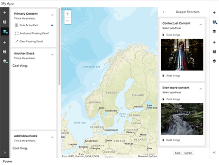

# calcite-app-components

A collection of calcite components for building single page applications.

[​](https://esri.github.io/calcite-app-components/)

​[View it live](https://esri.github.io/calcite-app-components/)

## Components

- [calcite-action](/src/components/calcite-action/readme.md)
- [calcite-action-bar](/src/components/calcite-action-bar/readme.md)
- [calcite-action-pad](/src/components/calcite-action-pad/readme.md)
- [calcite-block](/src/components/calcite-block/readme.md)
- [calcite-shell-floating-panel](/src/components/calcite-shell-floating-panel/readme.md)
- [calcite-flow](/src/components/calcite-flow/readme.md)
- [calcite-flow-item](/src/components/calcite-flow-item/readme.md)
- [calcite-shell](/src/components/calcite-shell/readme.md)
- [calcite-shell-panel](/src/components/calcite-shell-panel/readme.md)
- [calcite-tip](/src/components/calcite-tip/readme.md)
- [calcite-tip-manager](/src/components/calcite-tip-manager/readme.md)

## Installation

```
npm install --save @esri/calcite-app-components
```

### Script tag

`calcite-app-components` can be loaded via two `<script>` tags in the head of your HTML document:

```html
<script type="module" src="<path-to-calcite-app-components-package>/dist/calcite/calcite.esm.js"></script>
<script nomodule="" src="<path-to-calcite-app-components-package>/dist/calcite/calcite.js"></script>
```

Browsers that support modules will load the first, while older browsers will load the second, bundled version. It's worth noting that only components that are actually used will be loaded.

You will also need to add a `<link>` tag for the shared component styles:

```html
<link
  rel="stylesheet"
  href="<path-to-calcite-app-components-package>/dist/calcite/calcite.esm.js/dist/calcite/calcite.css"
/>
```

Once these tags are added, components can be used just like any other HTML element.

### Webpack

If you already have a webpack build for your project, you can simply use [@stencil/webpack](https://github.com/ionic-team/stencil-webpack) to add `calcite-app-components` to your bundle.

After installing `calcite-app-components`, install the plugin as a dev dependency:

```
npm install --save-dev @stencil/webpack
```

Then import and add the plugin in `webpack.config.js`:

```
const stencil = require('@stencil/webpack');

module.exports = {
  ...
  plugins: [
    new stencil.StencilPlugin()
  ]
}
```

Lastly, add the import in your main bundle js (or ts) file:

```
import '@esri/calcite-app-components/dist/calcite.js';
```

This will add the initial Stencil loader to your bundle, and copy over the actual component code to the output directory you've configured for Webpack. Components will still be lazy-loaded as they are needed. _Note:_ you must use the `.js` file path for the Webpack plugin to work correctly, even if your bundle file is a TypeScript file.

## TypeScript

Stencil provides a full set of typings for all the components in this repo. To make TypeScript aware of these components, just import the library:

```
import '@esri/calcite-app-components';
```

This will provide autocomplete of component names/properties, as well as additional HTML element types.

## Local Dev

### Instructions

1. npm install
2. npm start
3. npm test

### Requirements

- Notepad or your favorite HTML editor
- Web browser with access to the Internet

### Testing

#### Gotchas

Disabling headless mode and enabling devtools causes calls to `page.setContent(<html>)` to fail in end to end tests.
A workaround is manually modifying the waitUntil option in `<projectDir>\node_modules\@stencil\core\dist\testing\index.js` Line 39000 to 'load'.

## Updating Github Pages Docs

1. You'll need to generate a new stencil build for the docs by running `$ npm run docs`.
1. The docs will need to be committed or merged in the `master` branch before they take effect.

## Resources

- [ArcGIS for JavaScript API Resource Center](http://help.arcgis.com/en/webapi/javascript/arcgis/index.html)
- [ArcGIS Blog](http://blogs.esri.com/esri/arcgis/)
- [twitter@esri](http://twitter.com/esri)

## Issues

Find a bug or want to request a new feature? Please let us know by submitting an issue.

## Contributing

Esri welcomes contributions from anyone and everyone. Please see our [guidelines for contributing](https://github.com/esri/contributing).

## Licensing

Copyright 2019 Esri

Licensed under the Apache License, Version 2.0 (the "License");
you may not use this file except in compliance with the License.
You may obtain a copy of the License at

http://www.apache.org/licenses/LICENSE-2.0

Unless required by applicable law or agreed to in writing, software
distributed under the License is distributed on an "AS IS" BASIS,
WITHOUT WARRANTIES OR CONDITIONS OF ANY KIND, either express or implied.
See the License for the specific language governing permissions and
limitations under the License.

A copy of the license is available in the repository's [license.txt](https://raw.github.com/Esri/quickstart-map-js/master/license.txt) file.
