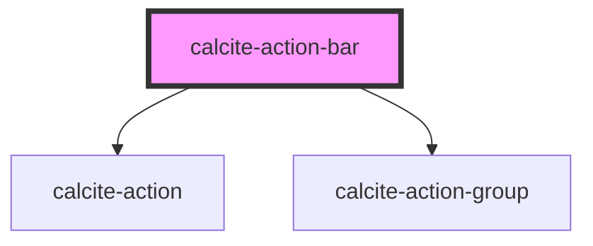

# calcite-action-bar

<!-- Auto Generated Below -->

## Properties

| Property       | Attribute       | Description | Type      | Default      |
| -------------- | --------------- | ----------- | --------- | ------------ |
| `expand`       | `expand`        |             | `boolean` | `true`       |
| `expanded`     | `expanded`      |             | `boolean` | `false`      |
| `textCollapse` | `text-collapse` |             | `string`  | `"Collapse"` |
| `textExpand`   | `text-expand`   |             | `string`  | `"Expand"`   |

## Dependencies

### Depends on

- [calcite-action](../calcite-action)
- [calcite-action-group](../calcite-action-group)

### Graph

---

_Built with [StencilJS](https://stenciljs.com/)_
