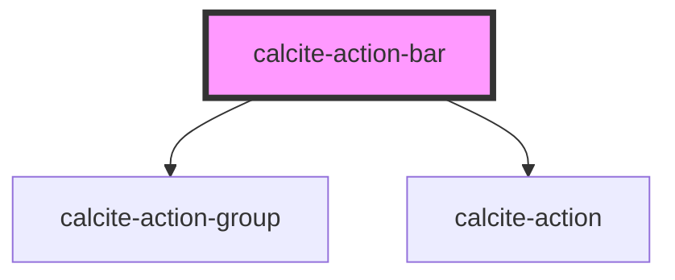

# calcite-action-bar

## Description

The `calcite-action-bar` component is made up of multiple `calcite-action`s in the form of clickable icons. The action bar can be expanded to view actions with descriptive text or made smaller to view with just icons.

<!-- Auto Generated Below -->

## Usage

### Basic

#### Basic Action Bar (Top Actions)

Renders `calcite-action`s that stick to the top of the bar.

```html
<calcite-action-bar>
  <calcite-action text="Add">
    <calcite-icon scale="s" icon="plus"></calcite-icon>
  </calcite-action>
  <calcite-action text="Save">
    <calcite-icon scale="s" icon="save"></calcite-icon>
  </calcite-action>
</calcite-action-bar>
```

#### With grouping

Renders a group of `calcite-action`s contained in a `calcite-action-group`. Actions in a group are visually separated from other groups or actions in the bar.

```html
<calcite-action-bar>
  <calcite-action-group>
    <calcite-action text="Add">
      <calcite-icon scale="s" icon="plus"></calcite-icon>
    </calcite-action>
    <calcite-action text="Save">
      <calcite-icon scale="s" icon="save"></calcite-icon>
    </calcite-action>
  </calcite-action-group>

  <calcite-action-group>
    <calcite-action text="Layers">
      <calcite-icon scale="s" icon="layers"></calcite-icon>
    </calcite-action>
    <calcite-action text="Basemaps">
      <calcite-icon scale="s" icon="layer-basemap"></calcite-icon>
    </calcite-action>
  </calcite-action-group>
</calcite-action-bar>
```

#### Bottom Actions

The bottom-actions slot renders `calcite-action`s that stick to the bottom of the bar above the expand/collapse icon.

```html
<calcite-action-bar>
  <calcite-action text="Information">
    <calcite-icon scale="s" icon="information"></calcite-icon>
  </calcite-action>

  <div slot="bottom-actions">
    <calcite-action text="Feedback">
      <calcite-icon scale="s" icon="mega-phone"></calcite-icon>
    </calcite-action>
  </div>
</calcite-action-bar>
```

## Properties

| Property         | Attribute         | Description                                                                                                                                                                                                                                                                | Type                      | Default     |
| ---------------- | ----------------- | -------------------------------------------------------------------------------------------------------------------------------------------------------------------------------------------------------------------------------------------------------------------------- | ------------------------- | ----------- |
| `expand`         | `expand`          | Indicates whether widget can be expanded.                                                                                                                                                                                                                                  | `boolean`                 | `true`      |
| `expanded`       | `expanded`        | Indicates whether widget is expanded.                                                                                                                                                                                                                                      | `boolean`                 | `false`     |
| `layout`         | `layout`          | <span style="color:red">**[DEPRECATED]**</span> since 5.3.0 - use "position" instead. Arrangement of the component. Leading and trailing are different depending on if the direction is LTR or RTL. For example, "leading" in a LTR app will appear on the left.<br/><br/> | `"leading" or "trailing"` | `undefined` |
| `localeCollapse` | `locale-collapse` | Updates the label of the collapse icon when the component is expanded.                                                                                                                                                                                                     | `string`                  | `undefined` |
| `localeExpand`   | `locale-expand`   | Updates the label of the expand icon when the component is not expanded.                                                                                                                                                                                                   | `string`                  | `undefined` |
| `position`       | `position`        | Arranges the component depending on the elements 'dir' property.                                                                                                                                                                                                           | `"end" or "start"`        | `undefined` |
| `textCollapse`   | `text-collapse`   | <span style="color:red">**[DEPRECATED]**</span> since 5.4.0 - use "localeCollapse" instead.<br/><br/>Updates the label of the collapse icon when the component is expanded.                                                                                                | `string`                  | `undefined` |
| `textExpand`     | `text-expand`     | <span style="color:red">**[DEPRECATED]**</span> since 5.4.0 - use "localeExpand" instead.<br/><br/>Updates the label of the expand icon when the component is not expanded.                                                                                                | `string`                  | `undefined` |
| `theme`          | `theme`           | Used to set the component's color scheme.                                                                                                                                                                                                                                  | `"dark" or "light"`       | `undefined` |

## Events

| Event                    | Description                             | Type               |
| ------------------------ | --------------------------------------- | ------------------ |
| `calciteActionBarToggle` | Emitted when expanded has been toggled. | `CustomEvent<any>` |

## Slots

| Slot               | Description                                                                                                             |
| ------------------ | ----------------------------------------------------------------------------------------------------------------------- |
|                    | A slot for adding `calcite-action`s that will appear at the top of the action bar.                                      |
| `"bottom-actions"` | A slot for adding `calcite-action`s that will appear at the bottom of the action bar, above the collapse/expand button. |

## Dependencies

### Depends on

- [calcite-action-group](../calcite-action-group)
- [calcite-action](../calcite-action)

### Graph



---

_Built with [StencilJS](https://stenciljs.com/)_
