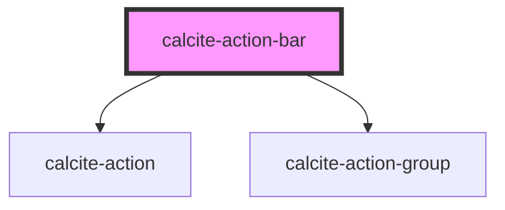

# calcite-action-bar

## Description

The `calcite-action-bar` component is made up of multiple [calcite-actions](../calcite-action) (such as Tips, Legend, Add etc.) in the form of clickable icons. The action bar can be expanded to view actions with descriptive text or made smaller to view with just icons.

<!-- Auto Generated Below -->

## Properties

| Property       | Attribute       | Description                               | Type      | Default      |
| -------------- | --------------- | ----------------------------------------- | --------- | ------------ |
| `expand`       | `expand`        | Indicates whether widget can be expanded. | `boolean` | `true`       |
| `expanded`     | `expanded`      | Indicates whether widget is expanded.     | `boolean` | `false`      |
| `textCollapse` | `text-collapse` |                                           | `string`  | `"Collapse"` |
| `textExpand`   | `text-expand`   |                                           | `string`  | `"Expand"`   |

## Dependencies

### Depends on

- [calcite-action](../calcite-action)
- [calcite-action-group](../calcite-action-group)

### Graph

---

_Built with [StencilJS](https://stenciljs.com/)_
