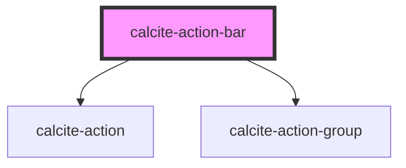

# calcite-action-bar

## Description

The `calcite-action-bar` component is made up of multiple `calcite-actions` in the form of clickable icons. The action bar can be expanded to view actions with descriptive text or made smaller to view with just icons.

See the [calcite-action-bar demo](https://esri.github.io/calcite-app-components/demos/calcite-action-bar.html).

<!-- Auto Generated Below -->

## Usage

### Basic

#### Basic Action Bar (Top Actions)

Renders `calcite-action`s that stick to the top of the bar.

```html
<calcite-action-bar>
  <calcite-action text="Add">
    <!-- icon -->
  </calcite-action>
  <calcite-action text="Save">
    <!-- icon -->
  </calcite-action>
</calcite-action-bar>
```

#### With grouping

Renders a group of `calcite-action`s contained in a `calcite-action-group`. Actions in a group are visually separated from other groups or actions in the bar.

```html
<calcite-action-bar>
  <calcite-action-group>
    <calcite-action text="Add">
      <!-- icon -->
    </calcite-action>
    <calcite-action text="Save">
      <!-- icon -->
    </calcite-action>
  </calcite-action-group>

  <calcite-action-group>
    <calcite-action text="Layers">
      <!-- icon -->
    </calcite-action>
    <calcite-action text="Basemaps">
      <!-- icon -->
    </calcite-action>
  </calcite-action-group>
</calcite-action-bar>
```

#### Bottom Actions

The bottom-actions slot renders `calcite-action`s that stick to the bottom of the bar above the expand/collapse icon.

```html
<calcite-action-bar>
  <calcite-action text="Information">
    <!-- icon -->
  </calcite-action>

  <div slot="bottom-actions">
    <calcite-action text="Feedback">
      <!-- icon -->
    </calcite-action>
  </div>
</calcite-action-bar>
```

## Properties

| Property       | Attribute       | Description                                                              | Type                      | Default      |
| -------------- | --------------- | ------------------------------------------------------------------------ | ------------------------- | ------------ |
| `expand`       | `expand`        | Indicates whether widget can be expanded.                                | `boolean`                 | `true`       |
| `expanded`     | `expanded`      | Indicates whether widget is expanded.                                    | `boolean`                 | `false`      |
| `layout`       | `layout`        | Arrangement of the component.                                            | `"leading" \| "trailing"` | `undefined`  |
| `textCollapse` | `text-collapse` | Updates the label of the collapse icon when the component is expanded.   | `string`                  | `"Collapse"` |
| `textExpand`   | `text-expand`   | Updates the label of the expand icon when the component is not expanded. | `string`                  | `"Expand"`   |
| `theme`        | `theme`         | Used to set the component's color scheme.                                | `"dark" \| "light"`       | `undefined`  |

## Events

| Event                    | Description                             | Type               |
| ------------------------ | --------------------------------------- | ------------------ |
| `calciteActionBarToggle` | Emitted when expanded has been toggled. | `CustomEvent<any>` |

## Slots

| Slot               | Description                                                                                                             |
| ------------------ | ----------------------------------------------------------------------------------------------------------------------- |
|                    | A slot for adding `calcite-actions` that will appear at the top of the action bar.                                      |
| `"bottom-actions"` | A slot for adding `calcite-actions` that will appear at the bottom of the action bar, above the collapse/expand button. |

## Dependencies

### Depends on

- [calcite-action](../calcite-action)
- [calcite-action-group](../calcite-action-group)

### Graph



---

_Built with [StencilJS](https://stenciljs.com/)_
