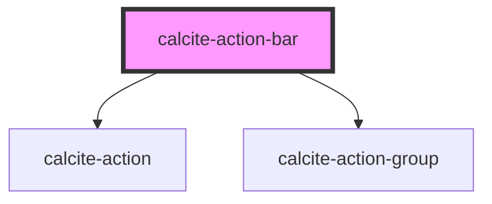

# calcite-action-bar

## Description

The `calcite-action-bar` component is made up of multiple `calcite-actions` in the form of clickable icons. The action bar can be expanded to view actions with descriptive text or made smaller to view with just icons.

See the [calcite-action-bar demo](https://esri.github.io/calcite-app-components/demos/calcite-action-bar.html).

## Slots

| Name             | Description                                                                                                            | Type                |
| ---------------- | ---------------------------------------------------------------------------------------------------------------------- | ------------------- |
| `bottom-actions` | A slot for adding `calcite-actions` that will apear at the bottom of the action bar, above the collapse/expand button. | `HTMLCalciteAction` |

<!-- Auto Generated Below -->

## Properties

| Property       | Attribute       | Description                                                              | Type                      | Default      |
| -------------- | --------------- | ------------------------------------------------------------------------ | ------------------------- | ------------ |
| `expand`       | `expand`        | Indicates whether widget can be expanded.                                | `boolean`                 | `true`       |
| `expanded`     | `expanded`      | Indicates whether widget is expanded.                                    | `boolean`                 | `false`      |
| `layout`       | `layout`        | Arrangement of the component.                                            | `"leading" \| "trailing"` | `undefined`  |
| `textCollapse` | `text-collapse` | Updates the label of the collapse icon when the component is expanded.   | `string`                  | `"Collapse"` |
| `textExpand`   | `text-expand`   | Updates the label of the expand icon when the component is not expanded. | `string`                  | `"Expand"`   |
| `theme`        | `theme`         | Used to set the component's color scheme.                                | `"dark" \| "light"`       | `undefined`  |

## Events

| Event                    | Description                             | Type               |
| ------------------------ | --------------------------------------- | ------------------ |
| `calciteActionBarToggle` | Emitted when expanded has been toggled. | `CustomEvent<any>` |

## Dependencies

### Depends on

- [calcite-action](../calcite-action)
- [calcite-action-group](../calcite-action-group)

### Graph

---

_Built with [StencilJS](https://stenciljs.com/)_
