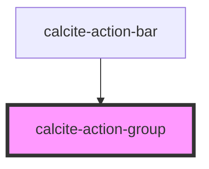

# calcite-action-group

The `calcite-action-group` is a wrapper for multiple `calcite-actions` and housed in `calcite-action-bar` and `calcite-action-pad`.

<!-- Auto Generated Below -->

## Dependencies

### Used by

 - [calcite-action-bar](../calcite-action-bar)

### Graph

----------------------------------------------

*Built with [StencilJS](https://stenciljs.com/)*
