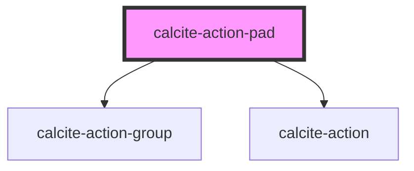

# calcite-action-pad

The `calcite-action-pad` component is made up of `calcite-action`s in the form of clickable icons. This does not have an expandable option and is a smaller and simpler component than `calcite-action-bar`.

<!-- Auto Generated Below -->

## Usage

### Basic

#### Basic Action Pad

Renders a basic action pad with `calcite-action`s.

```html
<calcite-action-pad>
  <calcite-action text="Undo">
    <calcite-icon scale="s" icon="undo"></calcite-icon>
  </calcite-action>
  <calcite-action text="Redo">
    <calcite-icon scale="s" icon="redo"></calcite-icon>
  </calcite-action>
</calcite-action-pad>
```

#### With Grouping

Renders a group of `calcite-action`s contained in a `calcite-action-group`. Actions in a group are visually separated from other groups or actions in the pad.

```html
<calcite-action-pad>
  <calcite-action-group>
    <calcite-action text="Home">
      <calcite-icon scale="s" icon="home"></calcite-icon>
    </calcite-action>
    <calcite-action text="Styles">
      <calcite-icon scale="s" icon="add-in-edit"></calcite-icon>
    </calcite-action>
  </calcite-action-group>

  <calcite-action text="Tips">
    <calcite-icon scale="s" icon="lightbulb"></calcite-icon>
  </calcite-action>
</calcite-action-pad>
```

## Properties

| Property       | Attribute       | Description                                                                                                                                                 | Type                      | Default     |
| -------------- | --------------- | ----------------------------------------------------------------------------------------------------------------------------------------------------------- | ------------------------- | ----------- |
| `expand`       | `expand`        | Indicates whether widget can be expanded.                                                                                                                   | `boolean`                 | `true`      |
| `expanded`     | `expanded`      | Indicates whether widget is expanded.                                                                                                                       | `boolean`                 | `false`     |
| `intlCollapse` | `intl-collapse` | Updates the label of the collapse icon when the component is expanded.                                                                                      | `string`                  | `undefined` |
| `intlExpand`   | `intl-expand`   | Updates the label of the expand icon when the component is not expanded.                                                                                    | `string`                  | `undefined` |
| `layout`       | `layout`        | <span style="color:red">**[DEPRECATED]**</span> use "position" instead.<br/><br/>Arrangement of the component.                                              | `"leading" \| "trailing"` | `undefined` |
| `position`     | `position`      | Arranges the component depending on the elements 'dir' property.                                                                                            | `"end" \| "start"`        | `undefined` |
| `textCollapse` | `text-collapse` | <span style="color:red">**[DEPRECATED]**</span> use "intlCollapse" instead.<br/><br/>Updates the label of the collapse icon when the component is expanded. | `string`                  | `undefined` |
| `textExpand`   | `text-expand`   | <span style="color:red">**[DEPRECATED]**</span> use "intlExpand" instead.<br/><br/>Updates the label of the expand icon when the component is not expanded. | `string`                  | `undefined` |
| `theme`        | `theme`         | Used to set the component's color scheme.                                                                                                                   | `"dark" \| "light"`       | `undefined` |

## Events

| Event                    | Description                             | Type               |
| ------------------------ | --------------------------------------- | ------------------ |
| `calciteActionPadToggle` | Emitted when expanded has been toggled. | `CustomEvent<any>` |

## Slots

| Slot | Description                                            |
| ---- | ------------------------------------------------------ |
|      | A slot for adding `calcite-action`s to the action pad. |

## Dependencies

### Depends on

- [calcite-action-group](../calcite-action-group)
- [calcite-action](../calcite-action)

### Graph



---

_Built with [StencilJS](https://stenciljs.com/)_
