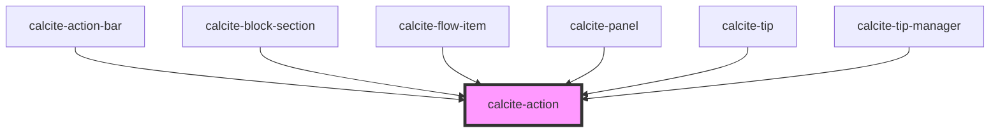

# calcite-action

The `calcite-action` component lives in either a `calcite-action-bar` or `calcite-action-pad`. Actions look like an icon with a text description option of the component that will be revealed when the icon/ text is clicked or selected.

See the [calcite-action demo](https://esri.github.io/calcite-app-components/demos/calcite-action.html).

<!-- Auto Generated Below -->

## Properties

| Property      | Attribute      | Description                                                                                       | Type                | Default     |
| ------------- | -------------- | ------------------------------------------------------------------------------------------------- | ------------------- | ----------- |
| `active`      | `active`       | Indicates whether the action is highlighted.                                                      | `boolean`           | `false`     |
| `compact`     | `compact`      | Compact mode is used internally by components to reduce side padding, e.g. calcite-block-section. | `boolean`           | `false`     |
| `disabled`    | `disabled`     | Disabled is used to prevent the action from occurring.                                            | `boolean`           | `false`     |
| `indicator`   | `indicator`    | Indicates unread changes.                                                                         | `boolean`           | `false`     |
| `label`       | `label`        | Label of the action, exposed on hover.                                                            | `string`            | `undefined` |
| `text`        | `text`         | Text that accompanies the action icon.                                                            | `string`            | `undefined` |
| `textEnabled` | `text-enabled` | Indicates whether the text is displayed.                                                          | `boolean`           | `false`     |
| `theme`       | `theme`        | Used to set the component's color scheme.                                                         | `"dark" \| "light"` | `undefined` |

## Dependencies

### Used by

- [calcite-action-bar](../calcite-action-bar)
- [calcite-block-section](../calcite-block-section)
- [calcite-flow-item](../calcite-flow-item)
- [calcite-panel](../calcite-panel)
- [calcite-tip](../calcite-tip)
- [calcite-tip-manager](../calcite-tip-manager)

### Graph

---

_Built with [StencilJS](https://stenciljs.com/)_
