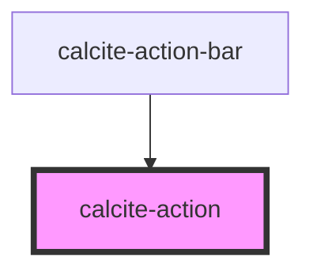

# calcite-action

<!-- Auto Generated Below -->

## Properties

| Property      | Attribute      | Description | Type      | Default     |
| ------------- | -------------- | ----------- | --------- | ----------- |
| `active`      | `active`       |             | `boolean` | `false`     |
| `indicator`   | `indicator`    |             | `boolean` | `false`     |
| `label`       | `label`        |             | `string`  | `undefined` |
| `text`        | `text`         |             | `string`  | `undefined` |
| `textEnabled` | `text-enabled` |             | `boolean` | `false`     |

## Events

| Event                | Description | Type               |
| -------------------- | ----------- | ------------------ |
| `calciteActionClick` |             | `CustomEvent<any>` |

## Dependencies

### Used by

- [calcite-action-bar](../calcite-action-bar)

### Graph

---

_Built with [StencilJS](https://stenciljs.com/)_
