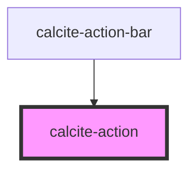

# calcite-action

The `calcite-action` component is an action item (such as Tip, Legend, Home etc.), typically housed in `calcite-action-bar` or `calcite-action-pad` in the form of a clickable icon with a text description option.

## Properties

| Property      | Attribute      | Description                             | Type      | Default     |
| ------------- | -------------- | --------------------------------------- | --------- | ----------- |
| `active`      | `active`       | Indicates whether the action is active. | `boolean` | `false`     |
| `indicator`   | `indicator`    |                                         | `boolean` | `false`     |
| `label`       | `label`        | Label of the action, exposed on hover.  | `string`  | `undefined` |
| `text`        | `text`         | Text that accompanies the action icon.  | `string`  | `undefined` |
| `textEnabled` | `text-enabled` | Indicates whether the text is enabled.  | `boolean` | `false`     |

## Events

| Event                | Description                      | Type               |
| -------------------- | -------------------------------- | ------------------ |
| `calciteActionClick` | Fires on the click of an action. | `CustomEvent<any>` |

## Dependencies

### Used by

- [calcite-action-bar](../calcite-action-bar)
- [calcite-action-pad](../calcite-action-pad)

### Graph

---

_Built with [StencilJS](https://stenciljs.com/)_
