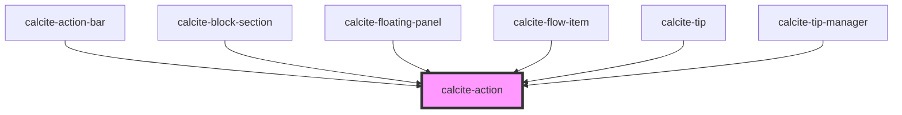

# calcite-action

The `calcite-action` component is an action item (such as Tip, Legend, Home etc.), typically housed in [calcite-action-bar](../calcite-action-bar) or [calcite-action-pad](../calcite-action-pad) in the form of a clickable icon with a text description option.

<!-- Auto Generated Below -->

## Properties

| Property      | Attribute      | Description                                                                                       | Type      | Default     |
| ------------- | -------------- | ------------------------------------------------------------------------------------------------- | --------- | ----------- |
| `active`      | `active`       | Indicates whether the action is highlighted.                                                      | `boolean` | `false`     |
| `compact`     | `compact`      | Compact mode is used internally by components to reduce side padding, e.g. calcite-block-section. | `boolean` | `false`     |
| `indicator`   | `indicator`    | Indicates unread changes.                                                                         | `boolean` | `false`     |
| `label`       | `label`        | Label of the action, exposed on hover.                                                            | `string`  | `undefined` |
| `text`        | `text`         | Text that accompanies the action icon.                                                            | `string`  | `undefined` |
| `textEnabled` | `text-enabled` | Indicates whether the text is displayed.                                                          | `boolean` | `false`     |

## Events

| Event                | Description                              | Type               |
| -------------------- | ---------------------------------------- | ------------------ |
| `calciteActionClick` | Emitted when an action has been clicked. | `CustomEvent<any>` |

## Dependencies

### Used by

- [calcite-action-bar](../calcite-action-bar)
- [calcite-block-section](../calcite-block-section)
- [calcite-floating-panel](../calcite-floating-panel)
- [calcite-flow-item](../calcite-flow-item)
- [calcite-tip](../calcite-tip)
- [calcite-tip-manager](../calcite-tip-manager)

### Graph

---

_Built with [StencilJS](https://stenciljs.com/)_
