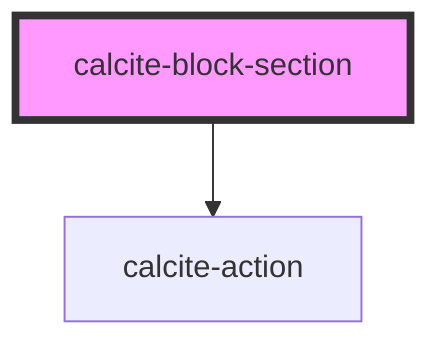

# calcite-block-section

<!-- Auto Generated Below -->

## Properties

| Property       | Attribute       | Description                                               | Type      | Default         |
| -------------- | --------------- | --------------------------------------------------------- | --------- | --------------- |
| `open`         | `open`          | When true, the block's section content will be displayed. | `boolean` | `false`         |
| `textCollapse` | `text-collapse` | Tooltip used for the toggle when expanded.                | `string`  | `TEXT.collapse` |
| `textExpand`   | `text-expand`   | Tooltip used for the toggle when collapsed.               | `string`  | `TEXT.expand`   |
| `textLabel`    | `text-label`    | Text displayed in the button.                             | `string`  | `undefined`     |

## Events

| Event                       | Description                               | Type               |
| --------------------------- | ----------------------------------------- | ------------------ |
| `calciteBlockSectionToggle` | Emitted when the header has been clicked. | `CustomEvent<any>` |

## Dependencies

### Depends on

- [calcite-action](../calcite-action)

### Graph

---

_Built with [StencilJS](https://stenciljs.com/)_
