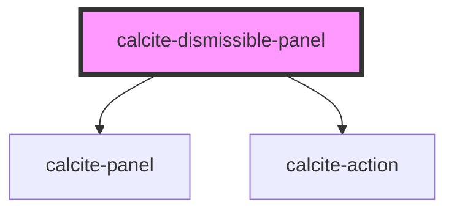

# calcite-dismissible-panel

<!-- Auto Generated Below -->

## Properties

| Property    | Attribute    | Description                               | Type                | Default      |
| ----------- | ------------ | ----------------------------------------- | ------------------- | ------------ |
| `heading`   | `heading`    | Heading text.                             | `string`            | `undefined`  |
| `textClose` | `text-close` | 'Close' text string for the close button. | `string`            | `TEXT.close` |
| `theme`     | `theme`      | Used to set the component's color scheme. | `"dark" \| "light"` | `undefined`  |

## Events

| Event                          | Description                                    | Type               |
| ------------------------------ | ---------------------------------------------- | ------------------ |
| `calciteDismissiblePanelClose` | Emitted when the back button has been clicked. | `CustomEvent<any>` |

## Dependencies

### Depends on

- [calcite-panel](../calcite-panel)
- [calcite-action](../calcite-action)

### Graph

---

_Built with [StencilJS](https://stenciljs.com/)_
