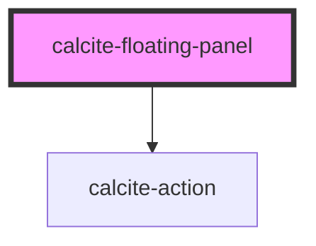

# calcite-floating-panel

<!-- Auto Generated Below -->

## Properties

| Property          | Attribute   | Description                                                                                                                                                                                                                                                                                       | Type                           | Default     |
| ----------------- | ----------- | ------------------------------------------------------------------------------------------------------------------------------------------------------------------------------------------------------------------------------------------------------------------------------------------------- | ------------------------------ | ----------- |
| `heading`         | `heading`   | Panel heading                                                                                                                                                                                                                                                                                     | `string`                       | `undefined` |
| `placement`       | `placement` | Determines where the element will be displayed. side: dynamically left or right based on whether we're in the primary or secondary shell-panel. over: centered on top of trigger and covers trigger. anchor: dynamically above or below based on how close trigger is to top or bottom of window. | `"anchor" \| "over" \| "side"` | `undefined` |
| `positionElement` | --          | HTMLElement used to position this element according to the placement.                                                                                                                                                                                                                             | `HTMLElement`                  | `undefined` |

## Dependencies

### Depends on

- [calcite-action](../calcite-action)

### Graph

---

_Built with [StencilJS](https://stenciljs.com/)_
