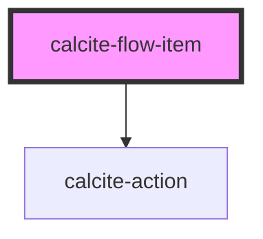

# calcite-flow-item

A `calcite-flow-item` is a child element of `calcite-flow` and lives in a panel with a heading and content.

See the [calcite-flow-item demo](https://esri.github.io/calcite-app-components/demos/calcite-flow-item.html).

<!-- Auto Generated Below -->

## Properties

| Property         | Attribute          | Description                               | Type                | Default      |
| ---------------- | ------------------ | ----------------------------------------- | ------------------- | ------------ |
| `heading`        | `heading`          | Heading text.                             | `string`            | `undefined`  |
| `menuOpen`       | `menu-open`        | Opens the action menu.                    | `boolean`           | `false`      |
| `showBackButton` | `show-back-button` | Shows a back button in the header.        | `boolean`           | `false`      |
| `textBack`       | `text-back`        | 'Back' text string.                       | `string`            | `TEXT.back`  |
| `textClose`      | `text-close`       | 'Close' text string for the menu.         | `string`            | `TEXT.close` |
| `textOpen`       | `text-open`        | 'Open' text string for the menu.          | `string`            | `TEXT.open`  |
| `theme`          | `theme`            | Used to set the component's color scheme. | `"dark" \| "light"` | `undefined`  |

## Events

| Event                      | Description                                    | Type               |
| -------------------------- | ---------------------------------------------- | ------------------ |
| `calciteFlowItemBackClick` | Emitted when the back button has been clicked. | `CustomEvent<any>` |

## Slots

| Slot               | Description                                                                                                                     |
| ------------------ | ------------------------------------------------------------------------------------------------------------------------------- |
| `"footer-actions"` | A slot for adding `calcite-actions` to the footer.                                                                              |
| `"menu-actions"`   | A slot for adding `calcite-actions` to a menu under the `...` in the header. These actions are displayed when the menu is open. |

## Dependencies

### Depends on

- [calcite-action](..\calcite-action)

### Graph

---

_Built with [StencilJS](https://stenciljs.com/)_
