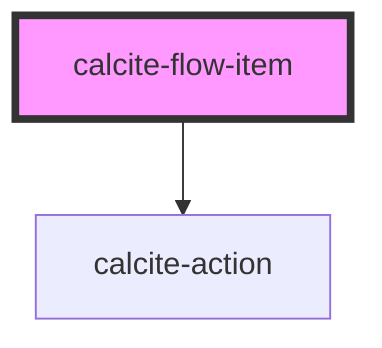

# calcite-flow-item

A flow item is used by [calcite-flow](../calcite-flow) lives in a panel with a heading and content.

<!-- Auto Generated Below -->

## Properties

| Property         | Attribute          | Description                        | Type                | Default      |
| ---------------- | ------------------ | ---------------------------------- | ------------------- | ------------ |
| `heading`        | `heading`          | Heading text.                      | `string`            | `undefined`  |
| `menuOpen`       | `menu-open`        | Opens the action menu.             | `boolean`           | `false`      |
| `showBackButton` | `show-back-button` | Shows a back button in the header. | `boolean`           | `false`      |
| `textBack`       | `text-back`        | 'Back' text string.                | `string`            | `TEXT.back`  |
| `textClose`      | `text-close`       | 'Close' text string.               | `string`            | `TEXT.close` |
| `textOpen`       | `text-open`        | 'Open' text string.                | `string`            | `TEXT.open`  |
| `theme`          | `theme`            | Element styling                    | `"dark" \| "light"` | `undefined`  |

## Events

| Event                      | Description                                    | Type               |
| -------------------------- | ---------------------------------------------- | ------------------ |
| `calciteFlowItemBackClick` | Emitted when the back button has been clicked. | `CustomEvent<any>` |

## Dependencies

### Depends on

- [calcite-action](../calcite-action)

### Graph

----------------------------------------------

*Built with [StencilJS](https://stenciljs.com/)*
