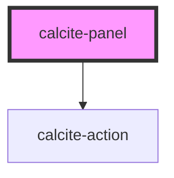

# calcite-panel

The `calcite-panel` component is a positioned container that appears relative to a `calcite-shell-panel` and is used to house temporary content.

<!-- Auto Generated Below -->

## Properties

| Property    | Attribute    | Description                           | Type     | Default      |
| ----------- | ------------ | ------------------------------------- | -------- | ------------ |
| `heading`   | `heading`    | Panel heading                         | `string` | `undefined`  |
| `textClose` | `text-close` | Alternate text for closing the panel. | `string` | `TEXT.close` |

## Events

| Event               | Description                                 | Type               |
| ------------------- | ------------------------------------------- | ------------------ |
| `calcitePanelClose` | Emitted when the component has been closed. | `CustomEvent<any>` |

## Dependencies

### Depends on

- [calcite-action](../calcite-action)

### Graph

---

_Built with [StencilJS](https://stenciljs.com/)_
