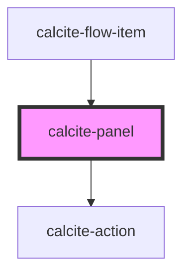

# calcite-panel

The `calcite-panel` component is a container that for a header, content and optionally a footer. The header will have centered content as well as optional leading and trailing content. The panel can also be setup to be dismissible which will allow it to be closed by a user.

<!-- Auto Generated Below -->

## Properties

| Property      | Attribute     | Description                                                                                               | Type                | Default      |
| ------------- | ------------- | --------------------------------------------------------------------------------------------------------- | ------------------- | ------------ |
| `disabled`    | `disabled`    | When true, disabled prevents interaction. This state shows items with lower opacity/grayed.               | `boolean`           | `false`      |
| `dismissed`   | `dismissed`   | Hides the panel.                                                                                          | `boolean`           | `false`      |
| `dismissible` | `dismissible` | Displays a close button in the trailing side of the header.                                               | `boolean`           | `false`      |
| `loading`     | `loading`     | When true, content is waiting to be loaded. This state shows a busy indicator.                            | `boolean`           | `false`      |
| `textClose`   | `text-close`  | 'Close' text string for the close button. The close button will only be shown when 'dismissible' is true. | `string`            | `TEXT.close` |
| `theme`       | `theme`       | Used to set the component's color scheme.                                                                 | `"dark" \| "light"` | `undefined`  |

## Events

| Event                         | Description                                     | Type               |
| ----------------------------- | ----------------------------------------------- | ------------------ |
| `calcitePanelDismissedChange` | Emitted when the close button has been clicked. | `CustomEvent<any>` |

## Slots

| Slot                        | Description                                                              |
| --------------------------- | ------------------------------------------------------------------------ |
| `"footer"`                  | A slot for adding `calcite-actions` to the footer.                       |
| `"header-content"`          | A slot for adding content in the center of the header.                   |
| `"header-leading-content"`  | A slot for adding a `calcite-action` on the leading side of the header.  |
| `"header-trailing-content"` | A slot for adding a `calcite-action` on the trailing side of the header. |

## Dependencies

### Used by

- [calcite-flow-item](../calcite-flow-item)

### Depends on

- [calcite-action](../calcite-action)

### Graph

---

_Built with [StencilJS](https://stenciljs.com/)_
