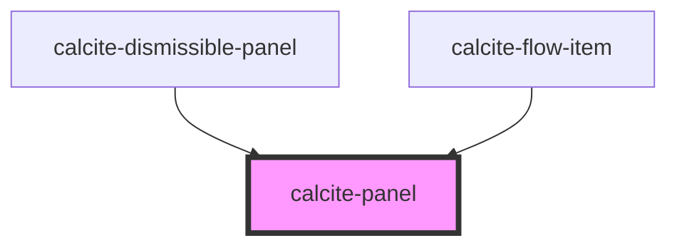

# calcite-panel

The `calcite-panel` component is a positioned container that appears relative to a `calcite-shell-panel` and is used to house temporary content.

<!-- Auto Generated Below -->

## Properties

| Property | Attribute | Description                               | Type                | Default     |
| -------- | --------- | ----------------------------------------- | ------------------- | ----------- |
| `theme`  | `theme`   | Used to set the component's color scheme. | `"dark" \| "light"` | `undefined` |

## Dependencies

### Used by

- [calcite-dismissible-panel](../calcite-dismissible-panel)
- [calcite-flow-item](../calcite-flow-item)

### Graph

---

_Built with [StencilJS](https://stenciljs.com/)_
