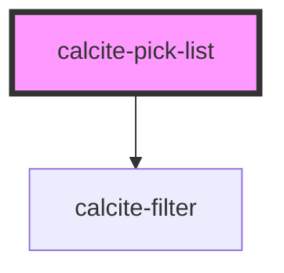

# calcite-pick-list

<!-- Auto Generated Below -->

## Properties

| Property        | Attribute        | Description                                                                                                                                                                                                                                                | Type                             | Default       |
| --------------- | ---------------- | ---------------------------------------------------------------------------------------------------------------------------------------------------------------------------------------------------------------------------------------------------------- | -------------------------------- | ------------- |
| `compact`       | `compact`        | Compact removes the selection icon (radio or checkbox) and adds a compact attribute. This allows for a more compact version of the pick-list-item.                                                                                                         | `boolean`                        | `false`       |
| `dragEnabled`   | `drag-enabled`   | **[DEPRECATED]** Prop is ignored. Prop will be removed in a future release.                                                                                                                                         | `boolean`                        | `false`       |
| `filterEnabled` | `filter-enabled` | When true, an input appears at the top of the list that can be used by end users to filter items in the list.                                                                                                                                              | `boolean`                        | `false`       |
| `loading`       | `loading`        | When true, content is waiting to be loaded. Show a busy indicator.                                                                                                                                                                                         | `boolean`                        | `false`       |
| `mode`          | `mode`           | **[DEPRECATED]** Prop is ignored. Prop will be removed in a future release.                                                                                                                                         | `"configuration" \| "selection"` | `"selection"` |
| `multiple`      | `multiple`       | Multiple Works similar to standard radio buttons and checkboxes. When true, a user can select multiple items at a time. When false, only a single item can be selected at a time, When false, selecting a new item will deselect any other selected items. | `boolean`                        | `false`       |
| `textHeading`   | `text-heading`   | **[DEPRECATED]** No longer rendered. Prop will be removed in a future release.  DEPRECATED: No longer rendered. Prop will be removed in a future release.                                                           | `string`                         | `undefined`   |

## Events

| Event                            | Description                                                                              | Type               |
| -------------------------------- | ---------------------------------------------------------------------------------------- | ------------------ |
| `calciteListChange`              |                                                                                          | `CustomEvent<any>` |
| `calcitePickListSelectionChange` | **[DEPRECATED]** use calciteListChange instead.   | `CustomEvent<any>` |

## Methods

### `getSelectedItems() => Promise<object>`

#### Returns

Type: `Promise<object>`

## Slots

| Slot             | Description                                                                  |
| ---------------- | ---------------------------------------------------------------------------- |
| `"menu-actions"` | A slot for adding a button + menu combo for performing actions like sorting. |

## Dependencies

### Depends on

- [calcite-filter](../calcite-filter)

### Graph

---

_Built with [StencilJS](https://stenciljs.com/)_
