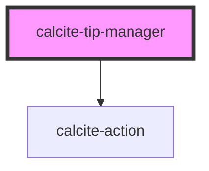

# calcite-tip-manager

The `calcite-tip-manager` component contains multiple `calcite-tips` that a user can view through via interactive arrows to go back and forth through the tips in the deck.

See the [calcite-tip-manager demo](https://esri.github.io/calcite-app-components/demos/calcite-tip-manager.html).

<!-- Auto Generated Below -->

## Properties

| Property              | Attribute               | Description                                        | Type                | Default                       |
| --------------------- | ----------------------- | -------------------------------------------------- | ------------------- | ----------------------------- |
| `closed`              | `closed`                | Alternate text for closing the Tip Manager.        | `boolean`           | `false`                       |
| `textClose`           | `text-close`            | Alternate text for closing the Tip Manager.        | `string`            | `TEXT.close`                  |
| `textDefaultTitle`    | `text-default-title`    | The default group title for the Tip Manager.       | `string`            | `TEXT.defaultGroupTitle`      |
| `textNext`            | `text-next`             | Alternate text for navigating to the next tip.     | `string`            | `TEXT.next`                   |
| `textPaginationLabel` | `text-pagination-label` | Label that appears on hover of pagination icon.    | `string`            | `TEXT.defaultPaginationLabel` |
| `textPrevious`        | `text-previous`         | Alternate text for navigating to the previous tip. | `string`            | `TEXT.previous`               |
| `theme`               | `theme`                 | Used to set the component's color scheme.          | `"dark" \| "light"` | `undefined`                   |

## Events

| Event                     | Description                                                                                           | Type               |
| ------------------------- | ----------------------------------------------------------------------------------------------------- | ------------------ |
| `calciteTipManagerClose`  | **[DEPRECATED]**   Emitted when the component has been closed. | `CustomEvent<any>` |
| `calciteTipManagerToggle` | Emitted when the TipManager has been toggled closed or opened.                                        | `CustomEvent<any>` |

## Methods

### `nextTip() => Promise<void>`

#### Returns

Type: `Promise<void>`

### `previousTip() => Promise<void>`

#### Returns

Type: `Promise<void>`

## Dependencies

### Depends on

- [calcite-action](../calcite-action)

### Graph

---

_Built with [StencilJS](https://stenciljs.com/)_
