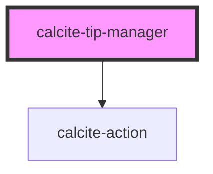

# calcite-tip-manager

The `calcite-tip-manager` component contains multiple `calcite-tips` that a user can view through via interactive arrows to go back and forth through the tips in the deck.

<!-- Auto Generated Below -->

## Properties

| Property              | Attribute               | Description                                     | Type                | Default                    |
| --------------------- | ----------------------- | ----------------------------------------------- | ------------------- | -------------------------- |
| `textDefaultTitle`    | `text-default-title`    | The default group title for the Tip Manager.    | `string`            | `DEFAULT_GROUP_TITLE`      |
| `textPaginationLabel` | `text-pagination-label` | Label that appears on hover of pagination icon. | `string`            | `DEFAULT_PAGINATION_LABEL` |
| `theme`               | `theme`                 | Element styling.                                | `"dark" \| "light"` | `undefined`                |

## Methods

### `nextTip() => Promise<void>`

#### Returns

Type: `Promise<void>`

### `previousTip() => Promise<void>`

#### Returns

Type: `Promise<void>`

## Dependencies

### Depends on

- [calcite-action](../calcite-action)

### Graph

---

_Built with [StencilJS](https://stenciljs.com/)_
