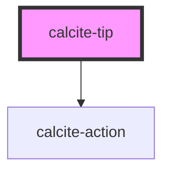

# calcite-tip

The `calcite-tip` component can comprise of an image, text and hyperlink to give helpful hints to a user about using the platform.

<!-- Auto Generated Below -->

## Properties

| Property         | Attribute         | Description                                         | Type                | Default     |
| ---------------- | ----------------- | --------------------------------------------------- | ------------------- | ----------- |
| `heading`        | `heading`         |                                                     | `string`            | `undefined` |
| `nonDismissible` | `non-dismissible` | Indicates whether the tip can be dismissed.         | `boolean`           | `false`     |
| `storageId`      | `storage-id`      | The local storage id used for an instance of a tip. | `string`            | `undefined` |
| `textThumbnail`  | `text-thumbnail`  |                                                     | `string`            | `undefined` |
| `theme`          | `theme`           | Element styling                                     | `"dark" \| "light"` | `undefined` |
| `thumbnail`      | `thumbnail`       |                                                     | `string`            | `undefined` |

## Dependencies

### Depends on

- [calcite-action](../calcite-action)

### Graph

----------------------------------------------

*Built with [StencilJS](https://stenciljs.com/)*
