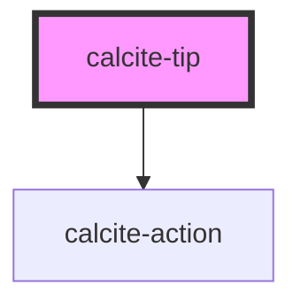

# calcite-tip

The `calcite-tip` component can comprise of an image, text and hyperlink to give helpful hints to a user about using the platform.

See the [calcite-tip demo](https://esri.github.io/calcite-app-components/demos/calcite-tip.html).

## Slots

| Name   | Description                                                      | Type                |
| ------ | ---------------------------------------------------------------- | ------------------- |
| `info` | A slot for adding an HTML element to the body of the tip.        | `HTMLElement`       |
| `link` | A slot for adding an HTML anchor element to the body of the tip. | `HTMLAnchorElement` |

<!-- Auto Generated Below -->

## Properties

| Property         | Attribute         | Description                                         | Type                | Default      |
| ---------------- | ----------------- | --------------------------------------------------- | ------------------- | ------------ |
| `heading`        | `heading`         | The heading of the tip.                             | `string`            | `undefined`  |
| `nonDismissible` | `non-dismissible` | Indicates whether the tip can be dismissed.         | `boolean`           | `false`      |
| `storageId`      | `storage-id`      | The local storage id used for an instance of a tip. | `string`            | `undefined`  |
| `textClose`      | `text-close`      | Alternate text for closing the tip.                 | `string`            | `TEXT.close` |
| `textThumbnail`  | `text-thumbnail`  | Alternate text for description of the thumbnail.    | `string`            | `undefined`  |
| `theme`          | `theme`           | Used to set the component's color scheme.           | `"dark" \| "light"` | `undefined`  |
| `thumbnail`      | `thumbnail`       | A string of the path to the thumbnail.              | `string`            | `undefined`  |

## Events

| Event               | Description                                    | Type               |
| ------------------- | ---------------------------------------------- | ------------------ |
| `calciteTipDismiss` | Emitted when the component has been dismissed. | `CustomEvent<any>` |

## Dependencies

### Depends on

- [calcite-action](../calcite-action)

### Graph

----------------------------------------------

*Built with [StencilJS](https://stenciljs.com/)*
