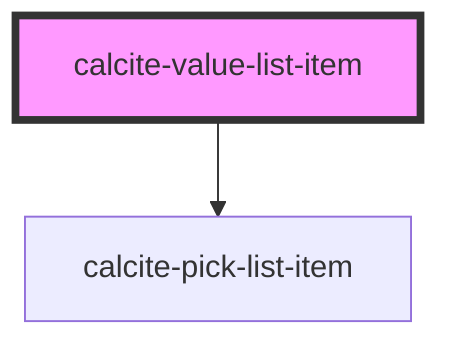

# calcite-value-list-item

<!-- Auto Generated Below -->

## Properties

| Property          | Attribute          | Description                                                                                       | Type                                                        | Default     |
| ----------------- | ------------------ | ------------------------------------------------------------------------------------------------- | ----------------------------------------------------------- | ----------- |
| `disabled`        | `disabled`         | When true, the item cannot be clicked and is visually muted                                       | `boolean`                                                   | `false`     |
| `icon`            | `icon`             | Determines the icon SVG symbol that will be shown. Options are circle, square, grid or null.      | `ICON_TYPES.circle \| ICON_TYPES.grip \| ICON_TYPES.square` | `null`      |
| `metadata`        | --                 | Used to provide additional metadata to an item, primarily used when the parent list has a filter. | `object`                                                    | `undefined` |
| `selected`        | `selected`         | Set this to true to pre-select an item. Toggles when an item is checked/unchecked.                | `boolean`                                                   | `false`     |
| `textDescription` | `text-description` | An optional description for this item. Will appear below the label text.                          | `string`                                                    | `undefined` |
| `textHeading`     | `text-heading`     | The main label for this item. Appears next to the icon.                                           | `string`                                                    | `undefined` |
| `value`           | `value`            | A unique value used to identify this item - similar to the value attribute on an <input>.         | `string`                                                    | `undefined` |

## Events

| Event                                | Description | Type               |
| ------------------------------------ | ----------- | ------------------ |
| `calciteValueListItemSelectedChange` |             | `CustomEvent<any>` |

## Methods

### `toggleSelected(coerce?: boolean, emit?: boolean) => Promise<void>`

#### Returns

Type: `Promise<void>`

## Dependencies

### Depends on

- [calcite-pick-list-item](../calcite-pick-list-item)

### Graph

---

_Built with [StencilJS](https://stenciljs.com/)_
