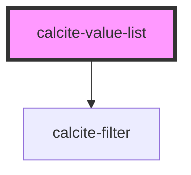

# calcite-value-list

`calcite-value-list` is housed in a panel and contains `calcite-value-list-items`. The value list has options for drag and drop, label editing, and single or multi select of items which can be done through shift+click.

<!-- Auto Generated Below -->

## Properties

| Property        | Attribute        | Description                                                                                                                                                                                                                                       | Type      | Default |
| --------------- | ---------------- | ------------------------------------------------------------------------------------------------------------------------------------------------------------------------------------------------------------------------------------------------- | --------- | ------- |
| `compact`       | `compact`        | Compact reduces the size of all items in the list.                                                                                                                                                                                                | `boolean` | `false` |
| `disabled`      | `disabled`       | When true, disabled prevents interaction. This state shows items with lower opacity/grayed.                                                                                                                                                       | `boolean` | `false` |
| `dragEnabled`   | `drag-enabled`   | When true, the items will be sortable via drag and drop.                                                                                                                                                                                          | `boolean` | `false` |
| `filterEnabled` | `filter-enabled` | When true, an input appears at the top of the list that can be used by end users to filter items in the list.                                                                                                                                     | `boolean` | `false` |
| `loading`       | `loading`        | When true, content is waiting to be loaded. This state shows a busy indicator.                                                                                                                                                                    | `boolean` | `false` |
| `multiple`      | `multiple`       | Multiple Works similar to standard radio buttons and checkboxes. When true, a user can select multiple items at a time. When false, only a single item can be selected at a time and selecting a new item will deselect any other selected items. | `boolean` | `false` |

## Events

| Event                    | Description                                           | Type               |
| ------------------------ | ----------------------------------------------------- | ------------------ |
| `calciteListChange`      | Emitted when any of the item selections have changed. | `CustomEvent<any>` |
| `calciteListOrderChange` | Emmitted when the order of the list has changed.      | `CustomEvent<any>` |

## Methods

### `getSelectedItems() => Promise<Map<string, object>>`

#### Returns

Type: `Promise<Map<string, object>>`

## Slots

| Slot             | Description                                                                                                     |
| ---------------- | --------------------------------------------------------------------------------------------------------------- |
|                  | A slot for adding pick-list-item elements or pick-list-groups elements. Items are displayed as a vertical list. |
| `"menu-actions"` | A slot for adding a button + menu combo for performing actions like sorting.                                    |

## Dependencies

### Depends on

- [calcite-filter](../calcite-filter)

### Graph

---

_Built with [StencilJS](https://stenciljs.com/)_
