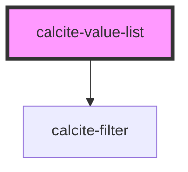

# calcite-value-list

<!-- Auto Generated Below -->

## Properties

| Property      | Attribute      | Description                                                                                                                                                                                                                                                | Type      | Default |
| ------------- | -------------- | ---------------------------------------------------------------------------------------------------------------------------------------------------------------------------------------------------------------------------------------------------------- | --------- | ------- |
| `dragEnabled` | `drag-enabled` | When true, the items will be sortable via drag and drop.                                                                                                                                                                                                   | `boolean` | `false` |
| `multiple`    | `multiple`     | Multiple Works similar to standard radio buttons and checkboxes. When true, a user can select multiple items at a time. When false, only a single item can be selected at a time, When false, selecting a new item will deselect any other selected items. | `boolean` | `false` |

## Events

| Event                             | Description | Type               |
| --------------------------------- | ----------- | ------------------ |
| `calciteValueListSelectionChange` |             | `CustomEvent<any>` |

## Methods

### `getSelectedItems() => Promise<object>`

#### Returns

Type: `Promise<object>`

## Dependencies

### Depends on

- [calcite-filter](../calcite-filter)

### Graph

---

_Built with [StencilJS](https://stenciljs.com/)_
